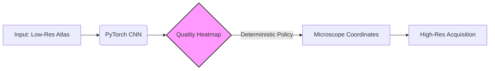

# Research Contributions

**Focus:** Computer Vision, Scientific Automation

---

## 🔬 Technical Deep Dive: Automated Cryo-EM Targeting

**Project:** Deep Learning for High-Throughput Microscope Guidance (2020–2021)  
**Stack:** PyTorch (`torch.nn`, `torchvision`, `torch.utils.data`), OpenCV, NumPy

### The Challenge
Cryo-EM data collection requires navigating a physical microscope to find rare, high-quality sample regions. Manual selection is a bottleneck. My goal was to replace human intuition with a computer vision model that could predict high-resolution quality from low-resolution "Atlas" scans.

### System Architecture

